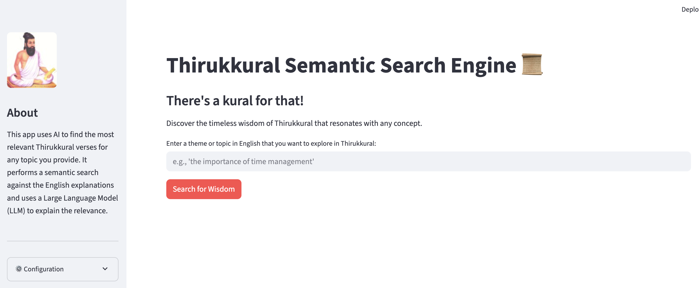
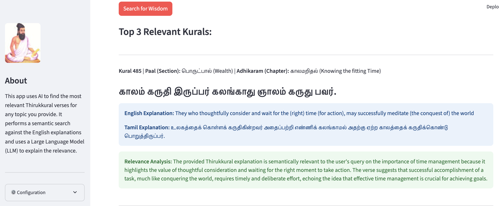

# Thirukkural Semantic Search Engine 📜

An intelligent, AI-powered Streamlit app to explore the timeless wisdom of the **Thirukkural**. Enter any topic or natural‑language query in English and the app surfaces the most semantically relevant Kurals — with the original Tamil, translations, and an AI explanation of *why* each verse matches your query.

---

## 🖼️ App Preview


*Homepage of the Thirukkural Semantic Search Engine*


*Example of a semantic search result*

---

## 🔗 Quick Links
- **Run locally:** `streamlit run app.py`
- **One-time setup:** `python embed_data.py` to build the vector DB
- **Switch LLMs:** Edit `src/config.py` → `SELECTED_LLM`

---

## ✨ Features
- **Semantic Search (Embeddings + Vector DB):** Finds meaningfully related Kurals beyond simple keywords.
- **Dual-Language Display:** Original Tamil verse plus Tamil/English explanations.
- **AI Relevance Reasoning:** A configurable LLM explains the match for each result.
- **Cloud or Local LLM (One-Line Switch):** Toggle between **Google Gemini** and **local Llama 3 (via Ollama)** by changing a single constant in `src/config.py`.

---

## 🛠️ Tech Stack
- **Language:** Python
- **Web Framework:** Streamlit
- **Embeddings:** `sentence-transformers`
- **Vector Database:** ChromaDB
- **LLMs (configurable):**
  - Google Gemini (via `google-generativeai`)
  - Local **Llama 3** (via **Ollama**)

---

## 🚀 Getting Started

### Prerequisites
- Python **3.8+** (3.10 recommended)
- (Optional for local LLM) **Ollama** installed: https://ollama.com
- macOS/Linux/Windows supported

### 1) Clone the repository
```bash
git clone https://github.com/vinovator/thirukkural_semantic_search_engine.git
cd thirukkural_semantic_search_engine
```

### 2) Create and activate a virtual environment
```bash
python3 -m venv venv
# macOS/Linux
source venv/bin/activate
# Windows (PowerShell)
# .\venv\Scripts\Activate.ps1
```

### 3) Install dependencies
```bash
pip install -r requirements.txt
```

### 4) (Optional) Set up Google Gemini API key
Create a file named **`.env`** in the project root:
```env
GEMINI_API_KEY="your_google_api_key_here"
```
> Tip: You can also export it in your shell instead of a `.env` file.

### 5) (Optional) Prepare local Llama 3 with Ollama
If you prefer running **fully offline** on your machine:
```bash
# Install Ollama if not already installed (see ollama.com)
# Then pull or run the model to download it once:
ollama pull llama3
# or
ollama run llama3
```

### 6) One-time: build the vector database
```bash
python embed_data.py
```
This reads `data/thirukkural_data.json`, generates embeddings, and stores them under `chromadb/`. You only need to run this once (rerun if you change the dataset or embedding model).

---

## ▶️ Usage

### Choose your LLM
Open **`src/config.py`** and set:
```python
SELECTED_LLM = LLM_GEMINI        # Use Google Gemini (cloud)
# or
SELECTED_LLM = LLM_LOCAL_LLAMA3  # Use local Llama 3 via Ollama
```

### Run the app
```bash
streamlit run app.py
```
Streamlit will open the app in your browser. If you selected the local model, ensure **Ollama** is running in the background.

---

## 📂 Project Structure
```text
thirukkural_semantic_search_engine/
├── .env                       # Your API keys (excluded from git)
├── .gitignore                 # Git ignore rules
├── README.md                  # Project docs
├── app.py                     # Streamlit app (UI)
├── embed_data.py              # One-time script to build vector DB
├── requirements.txt           # Python dependencies
├── data/
│   └── thirukkural_data.json  # Source dataset (post-transform)
├── chromadb/                  # Local vector database (auto-created)
├── img/                       # Images (optional; screenshots/diagrams)
├── transform/                 # One-time data preparation utilities
│   ├── merge_kural_data.py    # Script used to Merge/clean raw Kural files 
│   └── json/                  # place raw json files here before running the merge script
└── src/
    ├── __init__.py
    ├── config.py              # Central config + LLM master switch
    ├── llm_services.py        # All LLM calls live here
    └── search_logic.py        # Embedding + vector search pipeline
```

---

## 🤝 Acknowledgements
- The [`thirukkural_data.json`](data/thirukkural_data.json) dataset is sourced from the [**Thirukkural API**](https://github.com/tk120404/thirukkural) repository by **tk120404** on GitHub. Immense thanks for making this data publicly available.

---

## 🔮 Roadmap / Future Enhancements
- **Tamil Query Support:** Accept Tamil queries using a multilingual embedding model.
- **Filter by Section:** Dropdowns to filter by Paal/Adhikaram.
- **“Random Kural” Button:** Discover a random verse.
- **LLM Response Caching:** Reduce API calls and speed up repeated queries.
- **Cloud Deployment:** Use Streamlit secrets or env management (e.g., Spaces) safely.

---

## 🔐 Privacy & Security Notes
- No user queries are stored by default. Add logging consciously if needed.
- Keep secrets out of source control: use `.env`, environment variables, or Streamlit secrets.

---

## 🧰 Troubleshooting
- **`ModuleNotFoundError`**: Confirm your virtual env is activated and deps are installed.
- **No results / empty search**: Ensure you ran `python embed_data.py` and `chromadb/` exists.
- **Local model fails**: Verify Ollama is installed and `ollama run llama3` works independently.
- **Gemini errors**: Confirm `GEMINI_API_KEY` is present and valid.

---

## 📜 License
This project is licensed under the Creative Commons Attribution-NonCommercial 4.0 International License.
You may not use the material for commercial purposes. See the [LICENSE](LICENSE) file for details.

