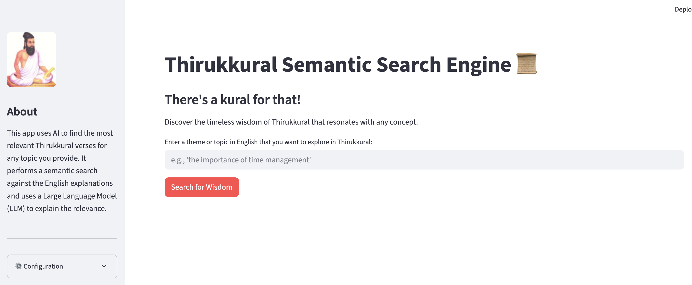
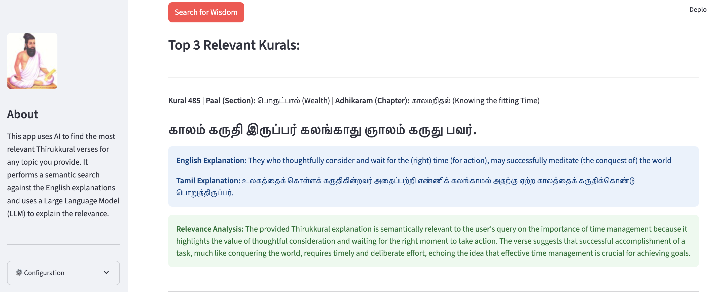

# Thirukkural Semantic Search Engine 📜

An intelligent, AI-powered Streamlit app to explore the timeless wisdom of the **Thirukkural**. Enter any topic or natural‑language query in English and the app surfaces the most semantically relevant Kurals — with the original Tamil, translations, and an AI explanation of *why* each verse matches your query.

---

## 🚀 Live Demo

Our Streamlit app is now live!  
Try out **Thirukkural Semantic Search** in action here:  

👉 [thereisakuralforthat.streamlit.app](https://thereisakuralforthat.streamlit.app/)

---

## 🖼️ App Preview


*Homepage of the Thirukkural Semantic Search Engine*


*Example of a semantic search result*

---

## 🔗 Quick Links
- **Run the app:** `streamlit run app.py`
- **One-time setup:** `python embed_data.py` to build the search artifacts

---

## ✨ Features

-   **Semantic Search:** Uses sentence-level embeddings to find meaningfully related Kurals beyond simple keywords.
-   **Two-Stage Retrieval:** A fast bi-encoder retrieves candidate Kurals, then a cross-encoder **re-ranker** re-scores them for precision. A relevance threshold means off-topic queries honestly return *no results* instead of forcing weak matches.
-   **Dual-Language Display:** Presents the original Tamil verse as a couplet, alongside both Tamil and English explanations.
-   **Flexible AI Backend:** A key feature of this project is its ability to run in three different modes, allowing you to choose between local performance, self-contained deployment, or a powerful cloud API.

---

## ⚙️ The Three Configurations

This app can be configured to use one of three different Large Language Models for its "Relevance Explainer" feature.

| Configuration | Use Case | How It Works |
| :--- | :--- | :--- |
| **1. Local with Ollama** | 🚀 Maximum performance on your local machine. | Connects to a running Ollama service to use powerful, quantized GGUF models (e.g., Llama 3, Phi-3). |
| **2. Hugging Face Spaces**| 📦 A self-contained, API-free deployment. | Runs a smaller model (e.g., TinyLlama) directly within the app using the Hugging Face `transformers` library. |
| **3. Streamlit Cloud** | ☁️ Lightweight, scalable cloud deployment. | Calls the powerful Google Gemini API for explanations. Requires an API key. |

---


## 🛠️ Tech Stack

-   **Language:** Python
-   **Web Framework:** Streamlit
-   **Embeddings:** `sentence-transformers` — bi-encoder `BAAI/bge-small-en-v1.5`
-   **Re-ranking:** `sentence-transformers` cross-encoder `cross-encoder/ms-marco-MiniLM-L-6-v2`
-   **Vector Search:** `scikit-learn` (Cosine Similarity) for first-stage retrieval
-   **LLM Backends (Configurable):**
    -   Google Gemini API (for Streamlit Cloud)
    -   Hugging Face `transformers` (for HF Spaces)
    -   Ollama (for high-performance local use)

---

## 🚀 Getting Started

### Prerequisites
- Python **3.9+**
- macOS/Linux/Windows supported

### 1) Clone the repository
```bash
git clone [https://github.com/vinovator/thirukkural_semantic_search_engine.git](https://github.com/vinovator/thirukkural_semantic_search_engine.git)
cd thirukkural_semantic_search_engine
```

### 2) Create and activate a virtual environment
```bash
python3 -m venv venv
# macOS/Linux
source venv/bin/activate
# Windows (PowerShell)
# .\venv\Scripts\Activate.ps1
```

### 3) Install dependencies
```bash
pip install -r requirements.txt
```

### 4) One-time: build the search artifacts
```bash
python embed_data.py
```
This script reads data/thirukkural_data.json, builds a composite document per Kural (English explanation + couplet + chapter theme), generates sentence embeddings, and saves them as kural_embeddings.npy and kural_metadata.pkl in the search_artifacts/ directory. Re-run it whenever the dataset or the embedding model in src/config.py changes.


### 5) Configure the LLM Provider
This is the most important step. Open 'src/config.py' and choose which mode to run by setting the 'LLM_PROVIDER' variable.

**Setup A: Local with Ollama (Default)**
1. Install and run Ollama on your machine.
2. Pull a model: 'ollama run llama3'
3. In 'src/config.py', ensure the provider is set to 'ollama':

```python
LLM_PROVIDER = os.getenv("LLM_PROVIDER", "ollama")
```

**Setup B: Local with Hugging Face 'transformers'**
1. No external software is needed.
2. In 'src/config.py', change the provider to 'huggingface':

```python
LLM_PROVIDER = os.getenv("LLM_PROVIDER", "huggingface")
```
*Note: The first time you run this, it will download the model (e.g., TinyLlama), which can take several minutes.*

**Setup C: Local with Gemini API**
1. Obtain a Google Gemini API key.
2. In 'src/config.py', change the provider to 'gemini':

```python
LLM_PROVIDER = os.getenv("LLM_PROVIDER", "gemini")
```
3. Set the environment variable for your API key in your terminal before running the app:
```bash
export GEMINI_API_KEY="AIza..."
```

---

## ▶️ Usage


### Run the app
```bash
streamlit run app.py
```
Streamlit will open the app in your browser. If you selected the local model, ensure **Ollama** is running in the background.

---

**☁️ Deployment**
### Hugging Face Spaces
1. Create a new Space and link your GitHub repository.
2. In the Space settings, add one Secret:
Name: 'LLM_PROVIDER'
Value: 'huggingface'
3. You may also need a packages.txt file if you use a library that requires system dependencies.

### Streamlit Community Cloud
1. Create a new app and link your GitHub repository.
2. In the app's advanced settings, add two Secrets:

- Secret 1:
    - Name: LLM_PROVIDER
    - Value: gemini
- Secret 2:
    - Name: GEMINI_API_KEY
    - Value: AIza... (Your actual Google Gemini API key)

---

## 📂 Project Structure
```text
thirukkural_semantic_search_engine/
├── README.md                  # This file
├── app.py                     # Streamlit app (UI)
├── embed_data.py              # One-time script to build search artifacts
├── requirements.txt           # Python dependencies
├── data/
│   └── thirukkural_data.json  # Source dataset
├── search_artifacts/          # Stored embeddings and metadata
│   ├── kural_embeddings.npy
│   └── kural_metadata.pkl
├── img/                       # App screenshots/diagrams
└── src/
    ├── __init__.py
    ├── config.py              # Central configuration
    ├── llm_services.py        # All LLM calls live here
    └── search_logic.py        # Two-stage retrieval: bi-encoder + cross-encoder re-ranker
```
---

## 🤝 Acknowledgements
- The [`thirukkural_data.json`](data/thirukkural_data.json) dataset is sourced from the [**Thirukkural API**](https://github.com/tk120404/thirukkural) repository by **tk120404** on GitHub. Immense thanks for making this data publicly available.

---

## 🔮 Roadmap / Future Enhancements
- **Tamil Query Support:** Accept Tamil queries using a multilingual embedding model.
- **Filter by Section:** Dropdowns to filter by Paal/Adhikaram.
- **“Random Kural” Button:** Discover a random verse.
- **LLM Response Caching:** Reduce API calls and speed up repeated queries.
- **Cloud Deployment:** Use Streamlit secrets or env management (e.g., Spaces) safely.

---

## 🔐 Privacy & Security Notes
- No user queries are stored by default. Add logging consciously if needed.
- The app is self-contained and does not require API keys or external network calls after the initial model download.

---

## 🧰 Troubleshooting
- **`ModuleNotFoundError`**: Confirm your virtual env is activated and deps are installed.
- **`ImportError: numpy.core.multiarray failed to import`**: Your **`numpy`** version is likely too new. Ensure **`numpy<2.0`** is in your **`requirements.txt`** and reinstall dependencies in a clean virtual environment.
- No search results: For an off-topic query this is expected — the relevance threshold filters weak matches. If *every* query returns nothing, ensure you have successfully run **`python embed_data.py`** and that the **`search_artifacts/`** directory and its files exist.
- Slow first load: The initial download and loading of the language model can take a significant amount of time and memory. This is expected.

---

## 📜 License
This project is licensed under the Creative Commons Attribution-NonCommercial 4.0 International License.
You may not use the material for commercial purposes. See the [LICENSE](LICENSE) file for details.

